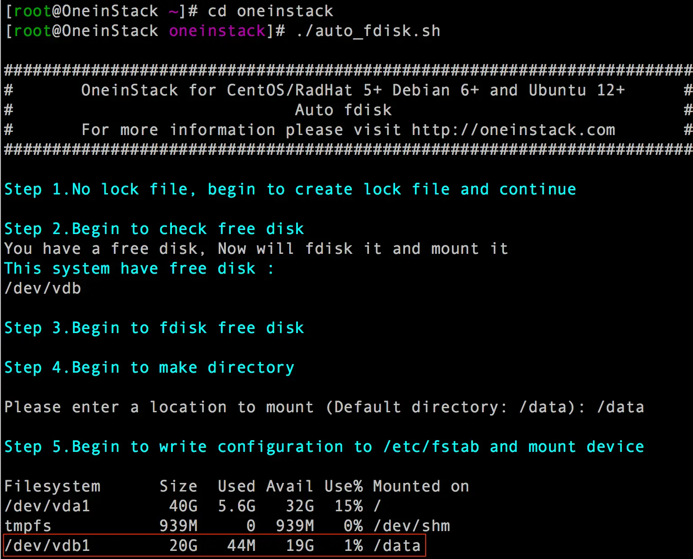

```json
{
  "date": "2021.07.29 10:00",
  "title": "Linux"
}
```


# 阿里云服务器自动挂载

### 下载脚本 执行
```
wget http://mirrors.linuxeye.com/scripts/auto_fdisk.sh
chmod +x ./auto_fdisk.sh
./auto_fdisk.sh

```

